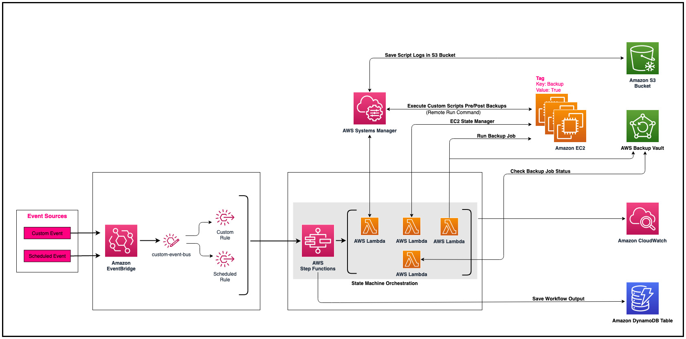

## Pre-Post-Backup-Solution
AWS Step Functions operates as the orchestrator layer in this solution and it is responsible from combining multiple services to achieve the desired output. The state machine provided in this solution has multiple tasks that are responsible for different pieces of the workflow. At a high-level the state machine processes an input where we specify the parameters that will be used for the job execution.
Based on the input parameters, the workflow will go through multiple steps where it will perform actions such as integrating with SSM to run the defined scripts, call EC2 APIs to stop/start the EC2 instance and call the AWS Backup APIs to initiate an on-demand backup.

## Architecture Diagram


# Pre-Requisites
1. Create a S3 bucket to store scripts, logs

    ```
    aws s3api create-bucket --bucket backup-status-bucket-<add-unique-string>
    ```

2. Upload scripts to ```backup-status-bucket-<add-unique-string>/scripts ```

    ```
    # create a pre-script
    echo "#!/bin/bash" > pre-script.sh 
    echo "" >> pre-script.sh 
    echo "echo \"Executing the pre-script\"" >> pre-script.sh 
    echo "date" >> pre-script.sh 
    echo "echo \"Completed executing the pre-script\"" >> pre-script.sh

    # put script in bucket
    aws s3api put-object --bucket backup-status-bucket-praghu --key scripts/pre-script.sh --body pre-script.sh
    ```

3. To all the EC2 instances that need to be backup add the following tag

    ```
    {
      "Key: "backup-job",
      "Value": "true"
    }
    ```

4. Install SSM agent if not already installed. Follow the steps given to [install the SSM agent](https://docs.aws.amazon.com/systems-manager/latest/userguide/sysman-manual-agent-install.html)

5. Add an IAM instance profile to the EC2 instance to give access to SSM and S3 bucket [Create Instance Profile](https://docs.aws.amazon.com/codedeploy/latest/userguide/getting-started-create-iam-instance-profile.html#getting-started-create-iam-instance-profile-console). Add the following managed policies to the role.

        a. AmazonSSMManagedInstanceCore
        b. AmazonS3ReadOnlyAccess

6. Extract the backupsolution-prepost.zip

    ```
    cd backupsolution-prepost
    sam deploy --guided

    Configuring SAM deploy
    ======================

        Looking for config file [samconfig.toml] :  Found
        Reading default arguments  :  Success

        Setting default arguments for 'sam deploy'
        =========================================
        Stack Name [backup-solution]: backup-solution
        AWS Region [us-east-1]: 
        #Shows you resources changes to be deployed and require a 'Y' to initiate deploy
        Confirm changes before deploy [Y/n]: Y
        #SAM needs permission to be able to create roles to connect to the resources in your template
        Allow SAM CLI IAM role creation [Y/n]: Y
        #Preserves the state of previously provisioned resources when an operation fails
        Disable rollback [y/N]: 
        Save arguments to configuration file [Y/n]: 
        SAM configuration file [samconfig.toml]: 
        SAM configuration environment [default]: 
    ```

7. Execute the step function with name `` with the following json updating the relevant fields.
   
   **BucketName** - Name of the bucket created in Step 1 (backup-status-bucket-<add-unique-string>)

   Go to CloudFormation Stack's resources tab and find the below values.
   
   **BackupJobExecutionRole** - Arn of BackupJobExecutionRole (Logical ID).

   **BackupVault** - Name of BackupVault (Logical ID).

    ```
    {
        "TargetEC2TagKey": "backup-job",
        "TargetEC2TagValue": "true",
        "StartStopEC2Required": true,
        "RemoteRunCommandDetails": {
            "PreBackupScriptDetails": {
            "SourceS3Path": "https://<BucketName>.s3.amazonaws.com/scripts/pre-script.sh",
            "CommandToRun": "pre-script.sh",
            "WorkingDirectory": "",
            "TimeoutInSeconds": 600,
            "OutputS3BucketName": "<BucketName>",
            "OutputS3KeyPrefix": "pre-script-logs"
            },
            "PostBackupScriptDetails": {
            "SourceS3Path": "https://<BucketName>.s3.amazonaws.com/scripts/pre-script.sh",
            "CommandToRun": "pre-script.sh",
            "WorkingDirectory": "",
            "TimeoutInSeconds": 600,
            "OutputS3BucketName": "<BucketName>",
            "OutputS3KeyPrefix": "post-script-logs"
            }
        },
        "BackupDetails": {
            "BackupVaultName": "<BackupVault>",
            "IamRoleArn": "<BackupJobExecutionRole>"
        }
    }
    ```

## Enable Scheduled Rule (Optional)    
If you need to run the solution on a schedule, you can 
   
   (a). Uncomment the resource **PrePostBackupEventsScheduledRule**  in template.yaml (line numbers 185-222)
   
   (b). Edit the cron expression on line number 190 as per your requirement. [How to set CRON expression](https://docs.aws.amazon.com/eventbridge/latest/userguide/eb-create-rule-schedule.html#eb-cron-expressions)

   (c). Edit the input of the target (line number 195) with appropriate information. This is the input that is used to invoke the statemachine on a schedule.
   
   (d) Run ```sam deploy``` to update the stack created in step 6.


## Input JSON

```
    {
        "TargetEC2TagKey": String,
        "TargetEC2TagValue": String,
        "TargetEC2Instances": [String],
        "StartStopEC2Required": boolean,
        "RemoteRunCommandDetails": {
            "PreBackupScriptDetails": {
                "SourceS3Path": String,
                "CommandToRun": String,
                "WorkingDirectory": String,
                "TimeoutInSeconds": Integer,
                "OutputS3BucketName": String,
                "OutputS3KeyPrefix": String
            },
            "PostBackupScriptDetails": {
                "SourceS3Path": String,
                "CommandToRun": String,
                "WorkingDirectory": String,
                "TimeoutInSeconds": Integer,
                "OutputS3BucketName": String,
                "OutputS3KeyPrefix": String
            }
        },
        "BackupDetails": {
            "BackupVaultName": String,
            "IamRoleArn": String
        }
    }
```

## Properties
[TargetEC2TagKey](#pre-requisites)  

User-defined criteria to select the target EC2 instances for which backup job needs to run. Either `TargetEC2TagKey` and `TargetEC2TagValue` combination or `TargetEC2Instances` need to be provided.

Type: String

Constraints: Minimum length of 1. Maximum length of 163.

Required: Conditional


[TargetEC2TagValue](#pre-requisites)  

User-defined criteria that maps to TargetEC2TagKey. Either both `TargetEC2TagKey` and `TargetEC2TagValue` or `TargetEC2Instances` need to be provided. Not both.

Type: String

Required: Conditional


[TargetEC2Instances](#pre-requisites)  

The list of EC2 instance ids for which backup job needs to run. Either both `TargetEC2TagKey` and `TargetEC2TagValue` combination or `TargetEC2Instances` need to be provided. Not both.

Type: Array of strings

Constraints: Array Members: Minimum number of 0 items. Maximum number of 50 items.

Required: Conditional

[StartStopEC2Required](#pre-requisites)  

Enabling this value will stop the EC2 instances after pre-script execution and before taking backup. Similarly the EC2 instances are started after the backup is completed but before running the post-script.

Type: Boolean

Required: No NEED TO TEST


[RemoteRunCommandDetails/PreBackupScriptDetails](#script-details)  

Specify the script details that runs before taking the backup. 

Type: ScriptDetails

Required: No

[RemoteRunCommandDetails/PostBackupScriptDetails](#script-details)  

Specify the script details that runs after taking the backup. 

Type: ScriptDetails

Required: No

[BackupDetails](#backup-details)  

Specify the details of the backup vault and the backup role. 

Type: BackupDetails

Required: Yes

---
### Backup Details

[BackupVaultName](#pre-requisites)  

The name of a logical container where backups are stored. Backup vaults are identified by names that are unique to the account used to create them and the AWS Region where they are created. They consist of lowercase letters, numbers, and hyphens.

Type: String

Constraints: Minimum length of 1. Maximum length of 50.

Required: Yes

[IamRoleArn](#pre-requisites)  

Specifies the IAM role ARN used to create the target recovery point; for example, arn:aws:iam::123456789012:role/S3Access.

Type: String

Required: Yes

---
### Script Details

[SourceS3Path](#pre-requisites)  

S3 path to the source script.

Type: String

Constraints: Minimum length of 1. Maximum length of 50.

Required: Yes

[CommandToRun](#pre-requisites)  

Specify the command line to be executed.

Type: String

Required: Yes

[WorkingDirectory](#pre-requisites)  

The path where the content will be downloaded and executed from on your instance.

Type: String

Required: No

[TimeoutInSeconds](#pre-requisites)  

If this time is reached and the command hasn't already started running, it won't run.

Type: String

Constraints: Minimum value of 30. Maximum value of 2592000.

Required: No

[OutputS3BucketName](#pre-requisites)  

The name of the S3 bucket where command execution responses should be stored.

Type: String

Constraints: Minimum length of 3. Maximum length of 63.

Required: No

[OutputS3KeyPrefix](#pre-requisites)  

The directory structure within the S3 bucket where the responses should be stored.

Type: String

Constraints: Minimum length of 1. Maximum length of 500.

Required: No


## Security

See [CONTRIBUTING](CONTRIBUTING.md#security-issue-notifications) for more information.

## License

This library is licensed under the MIT-0 License. See the LICENSE file.
